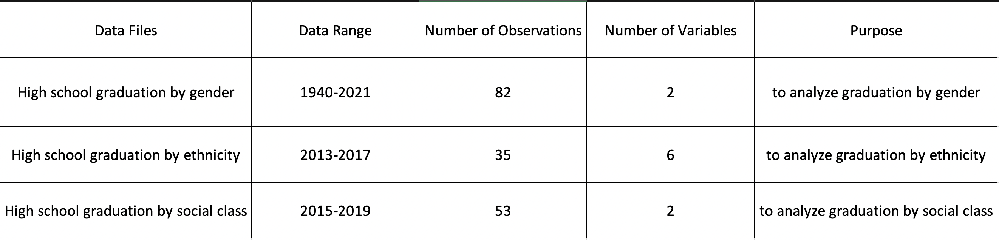

```{r setup, include=FALSE}
knitr::opts_chunk$set(echo = TRUE)
```

##### Authors
- Zonglin Zuo: zonglz2@uw.edu
- Hannah Wee: heew@uw.edu
- Bilal Duale: bduale@uw.edu
- Jesus Vargas: jfv97@uw.edu

###### _Code Name_: Grad-helpers

###### Affiliation:
INFO-201: Technical Foundations of Informatics - The Information School - University of Washington

## 1. Abstract:
Our main concern is correlation between intersectionality and a system of oppression based on social identity. Our question is how does gender, race, and social economic status affect equal education opportunities. To address this question, we analyzed the datasets of differences in graduation rates based on gender, race, and social economic status.

## 2. Keywords:
graduation rate, social justice, race, gender, social economic status

## 3. Introduction
In our project, our goal is to analyze and investigate the effect of intersectionality on system of oppression through examining existing high school graduation rate. For example, the datasets on high school graduates we discovered only included male and female. We want to adapt more diverse pronoun conventions, so we must focus on collecting diverse data on what individuals represent and choose to be. This will support us in resolving the design issue of having limited options for students to identify themselves, which is an act of advocating for equity that will benefit majority of population, a “co-liberation” process. Why do schools and data design have limited student identifiers? We want to enable students' preferences for being addressed and hope to highlight correlation with intersectionality and socioeconomic status.

## 4. Problem Domain

We investigated the data of U.S high school graduation rates and encountered that the data sets only have male and female listed.

* **Background**: We investigated the data of U.S high school graduation rates and encountered that the data sets only have male and female listed. We only have data that shows the graduation rate in high school by male or female. In Statista, it shows the percentage of graduates increasing from 39.5-90.6% from 1960-2021 If we want to adapt to our societies current standards where the stakeholders have the right to identify who they are by choice we can start modeling and collecting new data on what a person chooses to be.

* **Direct and Indirect Stakeholders**:
The stakeholders are not only students but also school administrators. We only have data that shows the graduation rate in high school by male or female. In Statista it shows the percentage of graduates increasing from 39.5-90.6% from 1960-2021. If we want to adapt to our societies current standards where the stakeholders, students, have the right to identify who they are by choice, we can encourage the administrators to be more inclusive and start modeling and collecting new data on what each student chooses to be. This will help us tackle the design situation where the data we collect only categorizes the students under male or female.

* **Human Values**:
The cultural and social question to be addressed is why aren’t school’s or the data design including other types of identifications for students? Additionally, the lower income students' graduation rate was 78% in those five years compared to the higher income students averaging 90.6% graduation rates. This raises the cultural and social question if lower income students aren’t getting the right resources to graduate. How do we explore solutions based on income and needs to increase this percentage?


* **Potential Benefits and Harms**: The benefits will be that by diving deeper into the root and understanding of students' personal choice to be voiced in what they want to be addressed as. We can collect data on not only male or female, but on what the person chooses to identify as. This will help future data sets start building a history of percentages to help us clean up data on the graduation rates of human’s who don’t categorize themselves as male or female. Therefore the more data collected the more we can get more specific on how to improve graduation rates. We are also tackling the data of graduation rates by household lower and higher household income collected from 2015-19. This data shows the graduation rates from kids that did qualify for free lunch and those who didn’t. Our third data this data set proves the 4-Year graduation rates in Iowa by cohort by race and ethnicity starting with the class of 2013. The harms are the datasets where there are limited pronoun by only marking female, male, or genderX. Another harm is that the datasets are organized in a confused way of where it does not specifically state if each row is information about a single or group of student. Yet, from the analyzing the datasets, we came to conclusion that each row represents information of a single student.


Citation:
- https://www.statista.com/statistics/184266/educational-attainment-of-high-school-diploma-or-higher-by-gender/
- https://www.mhec.org/dashboard/high-school-completion-income
- https://mydata.iowa.gov/Primary-Secondary-Ed/4-Year-High-School-Graduation-Rates-in-Iowa-by-Coh/xc4x-jnyq


## 5. Research question
* How does one's gender identity affect the percentage of high school students who graduate?
 > Important as a person's gender identification is, such inquiries may aid in gaining a deeper understanding of the motivations behind students' personal decisions, therefore fostering a more varied and inclusive environment.

* How does one's racial identity affect the percentage of high school students who graduate?
 > We live in an era of multicultural and multiracial coexistence, so we must investigate the extent to which racial identity influences a student in this context.

* How does a person's social status affect their likelihood of graduating from high school, and is it possible to judge that the prevalence of education is closely related to the social status of family members?
 > In most cases, income is used to categorize social classes. Whether low-income students have access to graduation resources comparable to those of high-income students raises cultural and social concerns. Therefore, this question is very important.

## 6. The Dataset



* **Dataset**:
For our group’s final project, we will be analyzing and working with datasets of social factors affecting high school graduation rate to further aim to include and represent diversity within gender and race of our target audience, students and academic organizations.

* **Dataset Source and Goal**:
We would be looking at data of gender, ethnicity, and social class of graduation rate in US from 2010 - 2019 provided by Statista and Tyler Data & Insights. The datasets will be visualized the number of high school graduates based on race, gender, and class. From analyzing the data, our group will gain knowledge of how much does social factor affect individual’s education opportunity. Our stakeholders are local public boards of education to enable an environment where individuals can equally achieve the same quality of education regardless of their racial, gender, or class background.

URL:
- https://www.statista.com/statistics/184266/educational-attainment-of-high-school-diploma-or-higher-by-gender/
- https://mydata.iowa.gov/Primary-Secondary-Ed/4-Year-High-School-Graduation-Rates-in-Iowa-by-Coh/xc4x-jnyq
- https://www.mhec.org/dashboard/high-school-completion-income

## 7. Expected Implication
- Our group expect to apply our founding of correlation between social background and graduation rate to future educational system to achieve co-liberation, where every student can receive benefit.
- Our group expects through visualization of datasets, we want to see a trend of social background and graduation rate to improve equality in education

## 8. Limitations
* We cannot cover the graduation data of all high schools in the United States for analysis and research. Therefore, we search for data from websites or research institutes for analysis.
*  Everyone's social, cultural, and experiential backgrounds and perspectives are unique. Thus, there are a great deal of social elements that will influence one person, not all of which will be addressed by our project. However, we will focus on three main social factors (gender identity, racial identity, and social status) in our project.


## Summary Paragraph

```{r summary,echo = FALSE, message=FALSE, warning=FALSE,results='asis'}
source("../source/data_access.R")
source("../source/summary_script.R")
data <- data_access_ethnicity()
summary(data)
```


## Table

```{r table, echo = FALSE, message=FALSE, warning=FALSE,results='asis'}
library(data.table)
library(knitr)
source("../source/to_table.R")
kable(table_output())
```
The high school graduation rate datasets we discovered was from 2019-2020. We first counted the number of individual data sets for each student group for 2018, "number_of_student_2018" to 2020, "number_of_student_2020". The students counted were from United States specifically and it was first organized to three different table for gender, ethnicity, and low-income to create separate visual representation for each of the following categories. Then to represent graduation rate of each "StudentGroup" graduation rate was calculated from 2018, "avg_grad_rate_2018" to 2020, "avg_grad_rate_2020".

## Chart 1
```{r chart1, echo = FALSE, message=FALSE, warning=FALSE}
library(ggplot2)
library(hrbrthemes)
source("../source/data_access.R")
source("../source/Chart1.R")
gender <- data_access_gender()
chart1(gender)
```

This graph clearly illustrates the correlation between the distributions. The graph reveals that although there are more male students, their graduation rate is not as high as that of female students; in addition, the number of students belonging to other gender groups is low, as is their graduation rate. Therefore, more tabular data may determine that women are more intelligent.

## Chart 2
```{r chart2, echo = FALSE, message=FALSE, warning=FALSE}
library(ggplot2)
source("../source/data_access.R")
source("../source/Chart2.R")
ethnicity <- data_access_ethnicity()
chart2(ethnicity)
```

This chart was selected because it clearly demonstrates a shift in the average graduation rate, as well as a flat state. The relationship between graduation rate and race is depicted in Figure 2. The graph reveals that Asian Americans have the greatest graduation rate, American Indians have the lowest, and the other student groups have nearly the same graduation rate. It is demonstrable that Asian-American student groups study diligently.

## Chart 3
```{r chart3, echo = FALSE, message=FALSE, warning=FALSE}
library(ggplot2)
source("../source/data_access.R")
source("../source/Chart3.R")
income <- data_access_income()
chart3(income)
```

This chart clearly illustrates a shifting trend and the phenomena of graduation. The chart reveals that the graduation rate of students with high income, i.e., a higher social class, is significantly higher than the graduation rate of students with low income, indicating that social class and education level are related and that people with higher income will spend more time on education. Nevertheless, it is evident that both variables belong to an increasing trend.

## 9. References:
4-year high school graduation rates in iowa by cohort and race/ethnicity | mydata. Iowa. Gov. (n.d.). Retrieved November 13, 2022, from https://mydata.iowa.gov/Primary-Secondary-Ed/4-Year-High-School-Graduation-Rates-in-Iowa-by-Coh/xc4x-jnyq

High school completion by income | midwestern higher education compact. (n.d.). Retrieved November 13, 2022, from https://www.mhec.org/dashboard/high-school-completion-income

Percentage of U.S. population who have completed high school 1960-2021. (n.d.). Statista. Retrieved November 13, 2022, from https://www.statista.com/statistics/184266/educational-attainment-of-high-school-diploma-or-higher-by-gender/

## 10. Appendix A: Questions:
What aspects of our project need to be improved?
