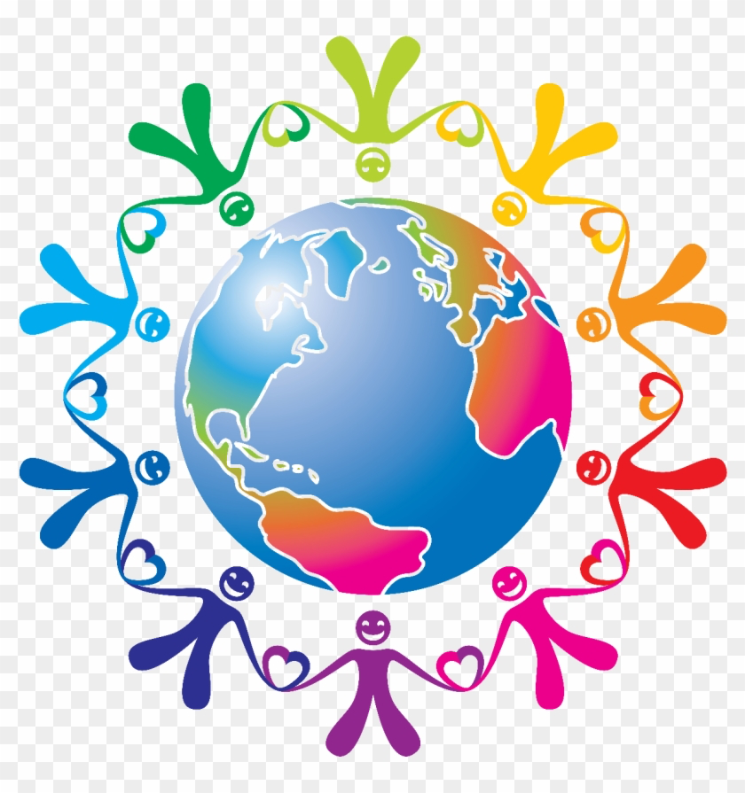

## Analyzing and investigating the effect of intersectionality on system of oppression in highschool graduation rates.
_Project Members: Bilal Duale, Jesus Vargas, Hannah Wee, Zonglin Zuo_ (Grad-helpers)

* **Project:**

>We want to adapt more diverse pronoun conventions, so we can focus on collecting diverse data on what individuals represent and choose to be so we can help graduation rates increase. Our goal is to analyze and investigate the effect of intersectionality on system of oppression through examining existing high school graduation rate. For example, the datasets on high school graduates we discovered only included male and female. We want to adapt more diverse pronoun conventions, so we must focus on collecting diverse data on what individuals represent and choose to be. This will support us in resolving the design issue of having limited options for students to identify themselves, which is an act of advocating for equity that will benefit majority of population, a “co-liberation” process.

* **Stakeholders:** Students in the U.S and faculty bringing

* **Problem:** The datasets on high school graduates we discovered only included male and female. We want to adapt more diverse pronoun conventions, so we must focus on collecting diverse data on what individuals represent and choose to be. This will support us in resolving the design issue of having limited options for students to identify themselves, which is an act of advocating for equity that will benefit majority of population, a “co-liberation” process. Why do schools and data design have limited student identifiers? We want to enable students' preferences for being addressed and hope to highlight correlation with intersectionality and socioeconomic status.

* **key findings:** By examining the data presented in the various graphs, we can see that there are significant differences between racial, income levels, and gender categories; however, there is an overall upward trend in graduation rates.

#### Guiding questions as we conducted the study:
* We developed three guiding questions for each social status and then answerd the questions with different types of graph and interactions with shiny widget:

>1. How does high school graduation rate vary depending on gender identity?
2. Does race identity of a student impact high school graduation rate?
3. Is there a correlation between high school graduation rate and income?
