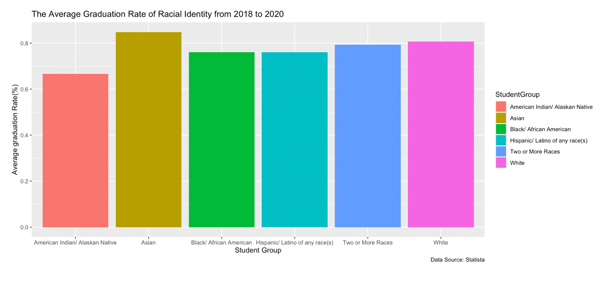
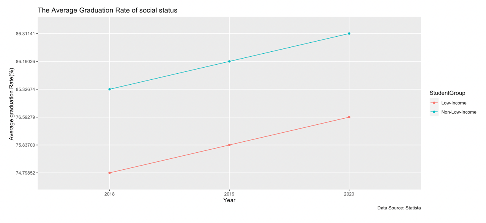
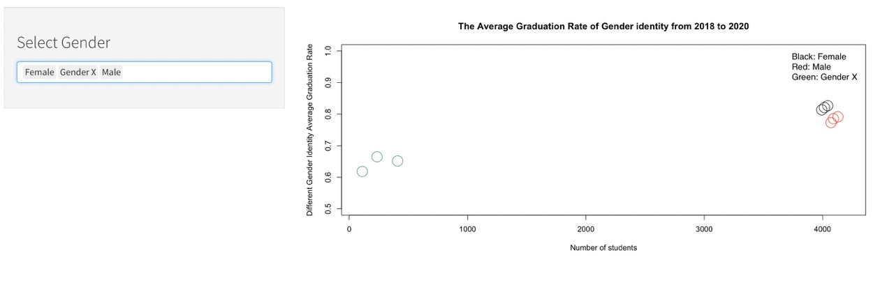

# Summary Takeaways:

* **Race** can play a significant role in determining an individual's education and career opportunities. In the United States, Native Americans have a 67% graduation rate, which is the lowest graduation rate among all racial groups. While Asians have 85% and Whites have 80% which is the highest graduation rate. This disparity is likely due to a combination of factors, including access to quality education, economic inequality, and systemic discrimination. It is important for schools and society as a whole to address these issues and provide support for disadvantaged groups in order to create a more equitable education system. This can help to **improve graduation rates and provide greater opportunities** for success for all individuals, regardless of their race.

* The comparison between **low and non-income individuals** can tell us a lot about the state of our society and the disparities that exist within it. In 2018, 74.8% of low-income individuals graduated high school. In 2019 75.8% graduated, and in 2020 76.5% graduated. Low-income individuals are often disadvantaged in many areas, including access to education, healthcare, and employment opportunities. This can lead to lower graduation rates and a lack of opportunities for advancement. In comparison to non-low-income individuals whose graduation rates in 2018, 2019, and 2020 were 85.3%, 86.2%, and 86.3%. Non-low-income individuals typically have greater access to resources and support, which can lead to higher graduation rates and more opportunities for success. This comparison highlights the need for **addressing income inequality and providing support** for disadvantaged individuals in order to create a more equitable society.

* **GenderX, or individuals who do not identify as male or female**, often face unique challenges in our society, which is largely based on a gender binary. The graduation rates and the number of students classified as Gender X are often lower compared to their male and female counterparts. The average graduation rates for genderx varies from 60 to 68%. In comparison to male graduation rates which is around 79% and females which is above 80%. This could be due to a lack of support and understanding from schools and society as a whole. In order to better understand and address this issue, it is important to collect and analyze data on Gender X individuals, as well as provide support and resources specifically tailored to their needs. This can help to create a more **inclusive and equitable education system** for all students.
